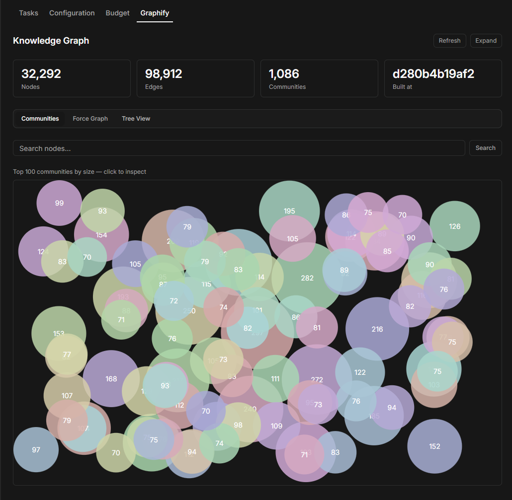
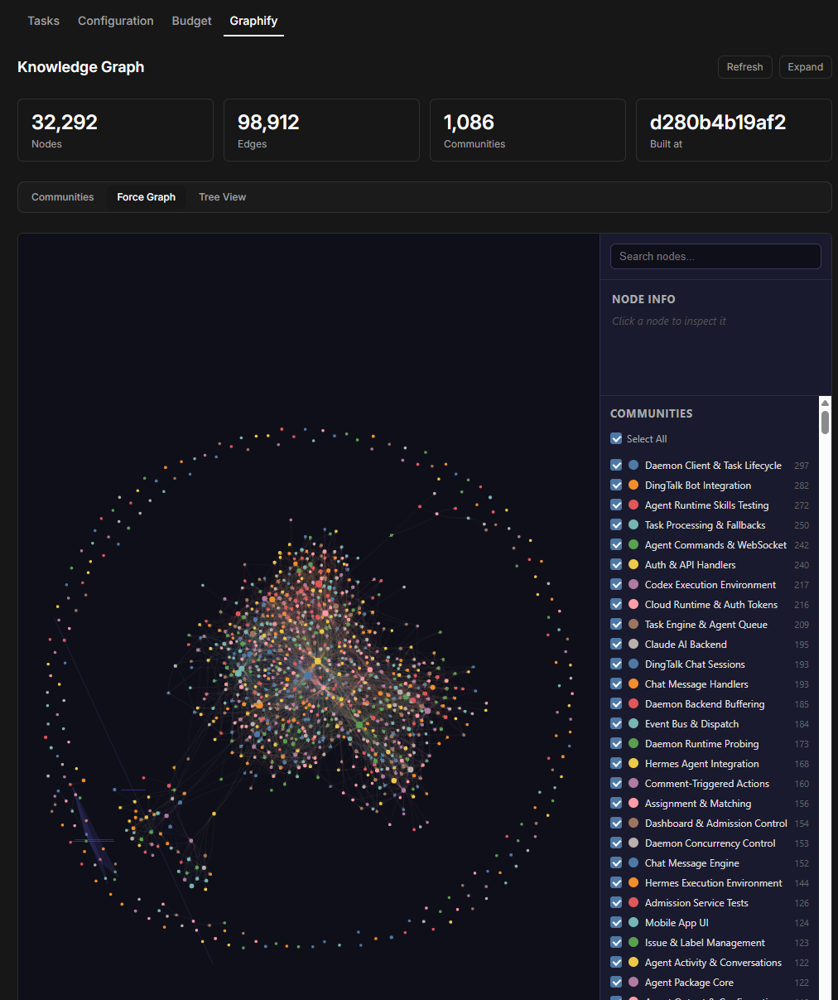
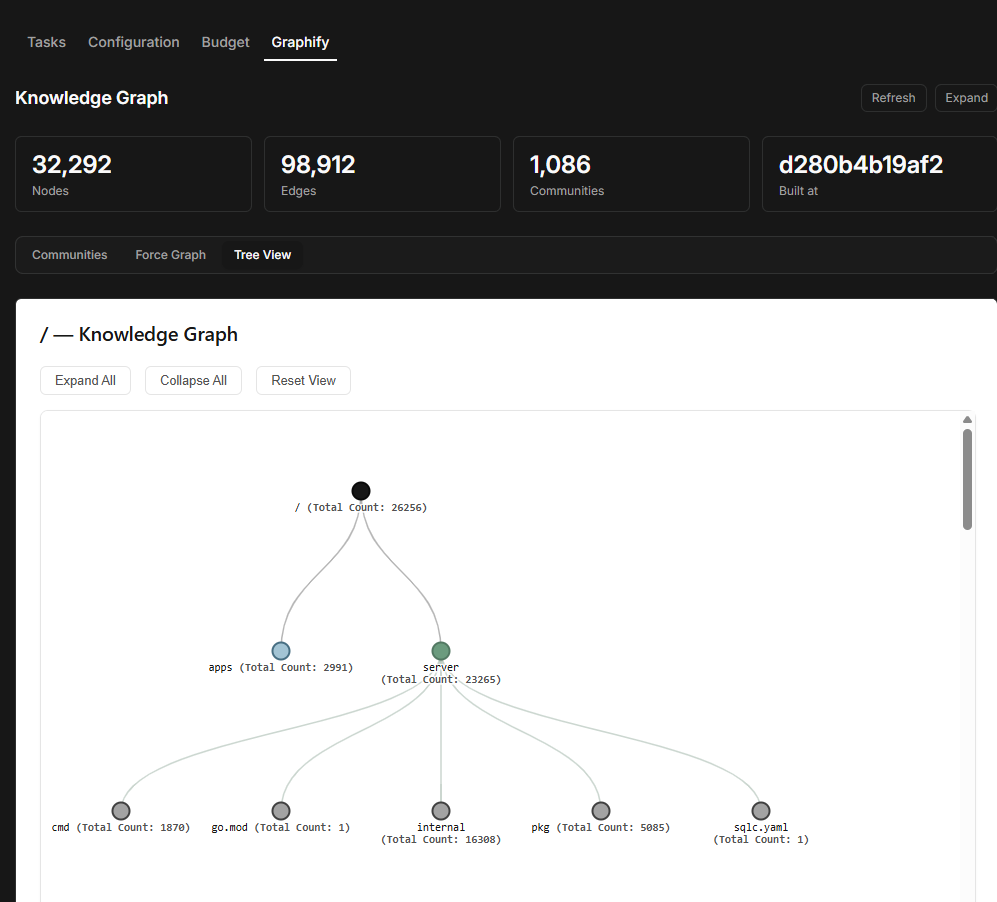

# @paperclipai/plugin-graphify

Knowledge graph plugin for [Paperclip](https://github.com/paperclipai/paperclip) — wraps the [Graphify](https://pypi.org/project/graphifyy/) CLI for agents and displays interactive graph visualizations per project.

## Install

> **Prerequisite:** You must install Graphify separately and build your first graph _before_ installing this plugin. The plugin reads graph data that Graphify produces — it does not install Graphify or run the codebase mapping itself. See [Install Graphify](#install-graphify-prerequisite) below.

```bash
paperclipai plugin install @paperclipai/plugin-graphify
```

Or pin a version:

```bash
paperclipai plugin install @paperclipai/plugin-graphify@0.6.0
```

Pre-built releases are available on the [Releases page](https://github.com/croakingtoad/paperclip/releases?q=plugin-graphify).

## Install Graphify (prerequisite)

Graphify is a Python CLI that scans a codebase and produces a knowledge graph with community detection, an audit trail, and queryable JSON output. Install it before using this plugin.

**With uv (recommended):**

```bash
uv tool install graphifyy
```

**With pip:**

```bash
pip install graphifyy
```

### Build your first graph

Run Graphify on your project to generate the `graphify-out/` directory containing `graph.json`:

```bash
cd /path/to/your/project
graphify .
```

This produces `graphify-out/graph.json` plus interactive HTML visualizations (`graph.html`, `GRAPH_TREE.html`). The plugin reads from this directory.

For incremental rebuilds after code changes:

```bash
graphify . --update
```

## What the plugin does

### Agent tools

The plugin registers four tools that Paperclip agents can call to navigate the knowledge graph instead of expensive grep/find operations:

| Tool | What it does |
|------|-------------|
| `graphify_query` | Natural-language search across the graph. Supports `--dfs` for depth-first tracing and `--budget N` to cap returned tokens. |
| `graphify_path` | Find the relationship path between two nodes (e.g. how `AuthService` connects to `DatabasePool`). |
| `graphify_explain` | Return everything the graph knows about a specific node — its edges, community membership, and context. |
| `graphify_build` | Trigger a graph build or incremental update from within an agent session. Supports `--mode deep` for aggressive inferred edges. |

### Agent instruction injection

When a project has `GRAPHIFY_GRAPH_PATH` set in its environment, Paperclip automatically adds a "Graphify Knowledge Graph" section to the default agent instructions. This teaches agents to prefer `graphify query/path/explain` over codebase-wide grep for structural questions like:

- "What depends on X?"
- "How does A relate to B?"
- "What modules handle authentication?"

Agents still fall back to grep/find for literal string searches or recent uncommitted changes the graph may not yet reflect.

The plugin also ships a managed skill that gets reconciled into projects, giving agents detailed guidance on when (and when not) to use each tool.

### Visualizations

The plugin adds interactive visualizations to the Paperclip UI:

- **Knowledge Graph page** — accessible from the sidebar, shows graph stats (nodes, edges, communities, build commit) and a searchable community bubble chart.
- **Project Graphify tab** — per-project detail tab with the same views scoped to that project's graph data. Supports fullscreen mode.
- **HTML views** — embeds any HTML visualizations Graphify generated (`graph.html` force-directed graph, `GRAPH_TREE.html` tree view, and any custom HTML files in the graph output directory) via tabbed iframe views.
- **Community explorer** — click any community bubble to inspect its nodes, edges, and source files.
- **Node search** — search nodes by label, ID, or source file path.

#### Communities

Interactive bubble chart of the top communities by size, with search and click-to-drill-down.



#### Force Graph

Embedded vis-network force-directed layout with community sidebar and node inspector.



#### Tree View

Collapsible D3 tree showing the project's file and symbol hierarchy.



## Configuration

The plugin resolves graph data from two sources, in order:

### Per-project (recommended)

Set `GRAPHIFY_GRAPH_PATH` in the project's environment variables (Configuration tab). Point it to the directory containing `graph.json`:

```
GRAPHIFY_GRAPH_PATH=/path/to/your/project/graphify-out
```

When a project workspace contains `graphify-out/graph.json`, Paperclip auto-detects it and offers a one-click banner to add this variable.

### Company-wide default

Set the "Graphify output" local folder in the plugin settings page. This applies to all projects that don't have their own `GRAPHIFY_GRAPH_PATH`.

## Development

The plugin source lives in `packages/plugins/plugin-graphify/` in the Paperclip monorepo.

```bash
cd packages/plugins/plugin-graphify
pnpm build        # build the plugin
pnpm typecheck    # type-check without emitting
pnpm test         # run tests
```

For local development with hot reload:

```bash
pnpm dev                                                    # in the plugin directory
paperclipai plugin install ./packages/plugins/plugin-graphify  # in the repo root
```

## License

MIT
